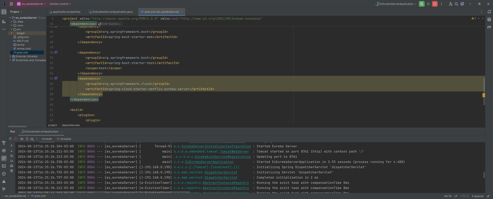
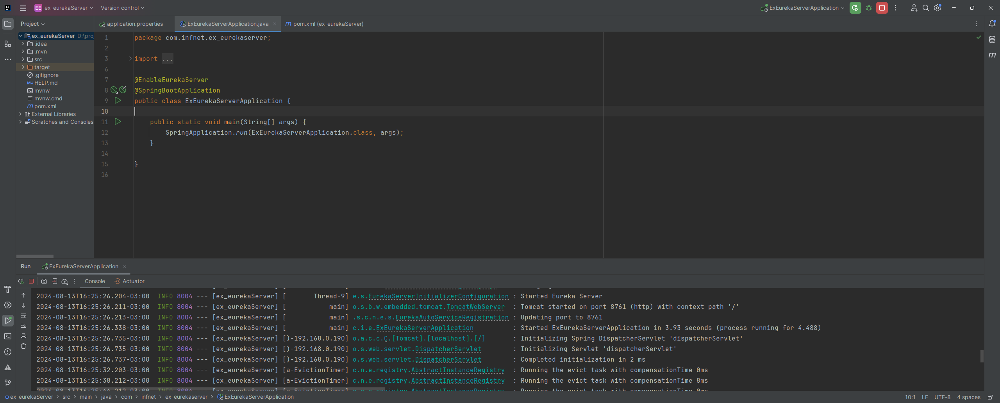
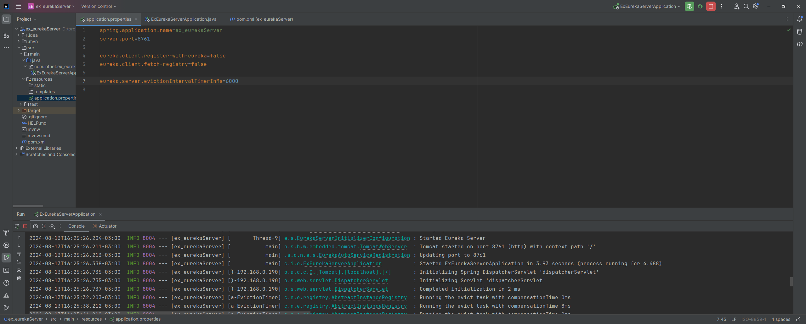
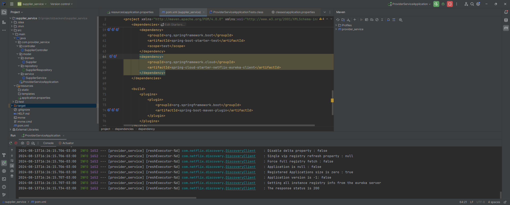
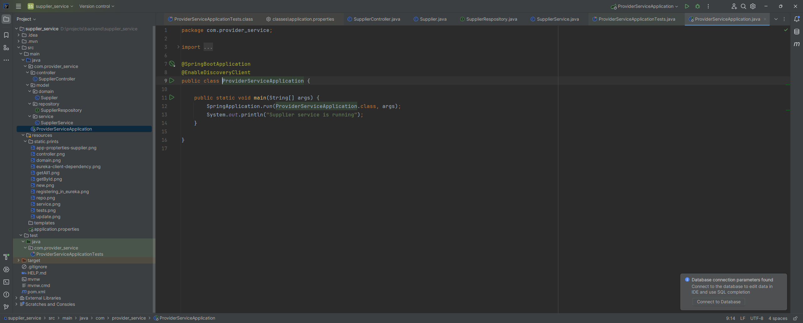
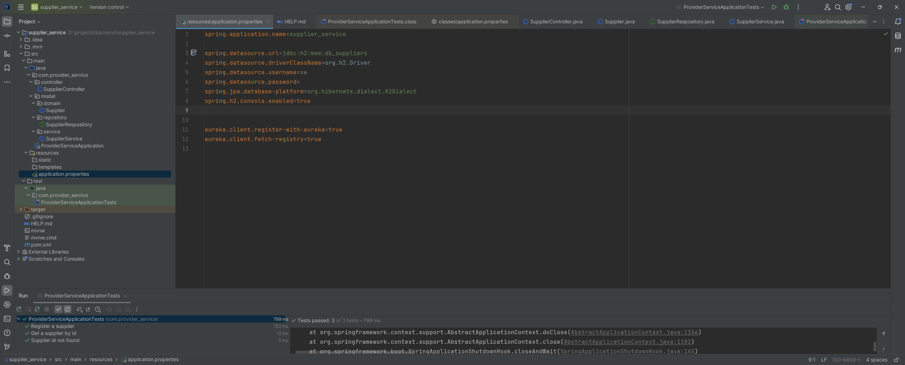
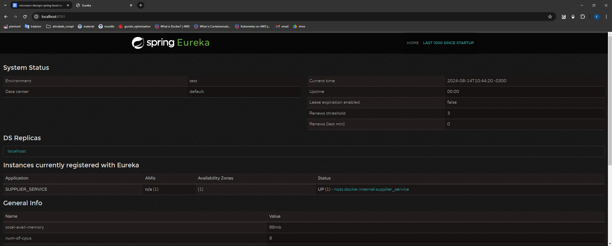

## Registering a Supplier service in a Eureka server
### Eureka server
* Dependency

  

* Annotation in Application Main

  

* Definning a port and making self-registration unbable

  

### Supplier service
* Dependency

  

* Annotation in Application Main

  

* Connecting to Eureka server and enabling the registration

  

* Registered Supplier service

  

